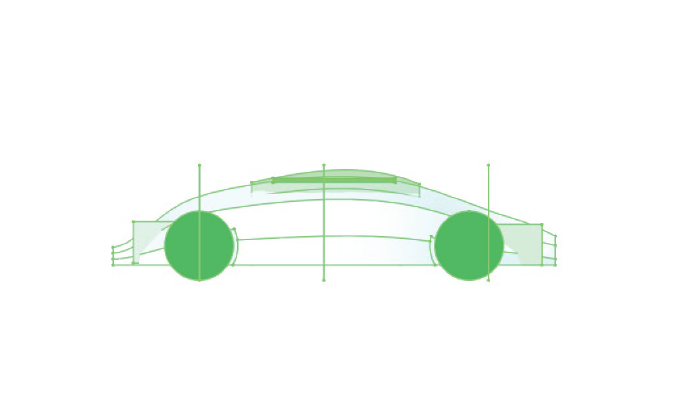
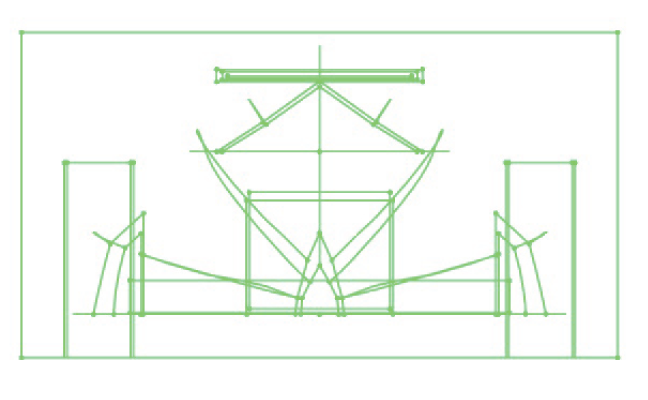
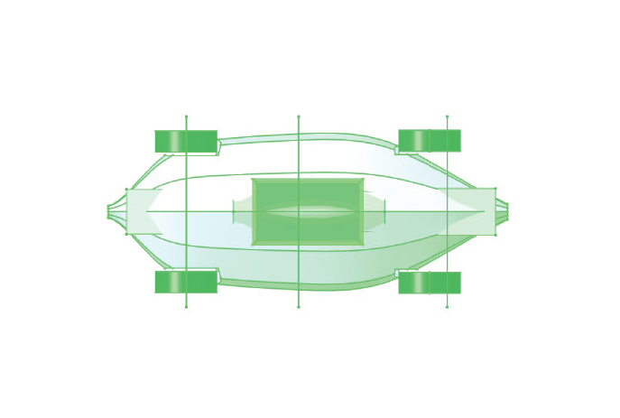

# Life Cycle Environmental Assessment of Hybrid Electric Vehicles With Integrated Solar and Range Extension Technologies

**Portfolio Edition: Rethinking Vehicle Architecture Through New Fuel Strategies and Biomimetic Design**

**April 2026**

**By Andreina Virunurm and AI assisted writing.**
---

## Abstract

This portfolio dissertation asks a simple but far-reaching question: if automobiles have been revised for decades without escaping the logic of the conventional car, what becomes possible when the vehicle is reimagined around new fuel pathways and biomimetic design principles rather than incremental styling updates alone? The Freya GT-E is used here as a concept platform for that question. Its architecture combines a 60 kWh traction battery, a combustion-backed range extender, and an integrated solar surface. The analytical contribution of this research is methodological as much as conceptual. Observed public data are used wherever they can be documented, Freya-specific quantities are modeled only where no measured Freya record exists, and future cases are clearly labeled as scenario projections rather than empirical tests. The simulation and calculations use a combination of open-data and randomized python generated data as the baseline cradle-to-grave total for Freya remains 20,515.7 kg CO2-eq, compared with 24,803.2 kg for the 70 kWh battery-electric comparator, 24,650.9 kg for the plug-in hybrid comparator, and 32,748.8 kg for the internal-combustion baseline. The dissertation therefore tells a complete scientific-method story: observation, question, hypothesis, model design, execution, results, interpretation, and limits. Read as a portfolio piece, the work argues that the real innovation challenge is not merely improving the next car revision, but reconsidering the vehicle itself as an adaptive energy organism whose form and fuel logic may need to change together.

---

## CHAPTER 1: INTRODUCTION AND MOTIVATION

### 1.1 Observation and Problem Context

Automotive engineering has long excelled at revision. Body shells become lighter, electronics become denser, drivetrains become more efficient, and the visual language of performance evolves from one generation to the next. Yet the dominant vehicle template remains remarkably stable: a fixed cabin, a fixed propulsion hierarchy, a fuel strategy that is added onto the car rather than integrated into its spatial logic, and a design process that treats the vehicle as an object instead of a responsive system. That design inertia matters because climate and resource pressures no longer reward only incremental improvement. They reward architectures that use energy more intelligently over the full life cycle.

This dissertation begins with that observation. If the car has already undergone countless revisions, why should the next answer be another revision of the same template? Why not ask whether vehicle design should be rethought from first principles around new fuel strategies, smaller and better-matched storage systems, distributed energy capture, and forms inspired by the economy and adaptation found in biological systems? In this study, biomimetic design is not treated as decorative styling. It functions as a conceptual lens for asking how a vehicle might conserve mass, allocate energy selectively, and respond to environmental constraints the way living systems do.

### 1.2 Research Question and Hypothesis

The central research question is whether a rethought concept platform such as the Freya GT-E can deliver lower lifecycle emissions than conventional alternatives when the analysis is rebuilt around documented open inputs. The dissertation tests a specific hypothesis: a platform that right-sizes battery capacity, reserves combustion use for the share of travel that still benefits from fuel resilience, and uses integrated solar generation as a supplementary energy source can outperform a larger-battery BEV under mixed-grid conditions while remaining consistently lower-carbon than representative PHEV and ICE baselines.

The hypothesis is intentionally conditional. It does not assume that one architecture wins under every future electricity case. Instead, it asks which design logic is favored under which operating and grid conditions. That framing is essential to the scientific-method story because it moves the work away from advocacy and toward falsifiable comparison.

### 1.3 Why the Theme Matters

The thematic argument of the dissertation is therefore larger than the Freya platform itself. The work proposes that transportation design should be willing to break from inherited assumptions about how much battery is needed, when combustion must occur, where solar should sit in the hierarchy of power sources, and how vehicle form might evolve if efficiency and adaptation were treated as system-level design goals. In portfolio form, that argument highlights the author's interest in vehicle design as an engineering imagination problem rather than only an optimization problem.

### 1.4 Scientific Method Roadmap

The scientific method used in the dissertation unfolds in seven steps:

1. The study states the observation that current vehicle evolution remains constrained by an inherited template.
2. It formulates a question about whether a differently prioritized concept vehicle can improve lifecycle outcomes.
3. It states a testable hypothesis.
4. It assembles a hybrid evidence structure, distinguishing observed inputs from modeled Freya-specific values and future scenarios.
5. It executes deterministic calculations and a Monte Carlo simulation.
6. It compares the resulting totals with control vehicles.
7. It interprets what the results say about vehicle architecture, energy strategy, and design direction.

---

## CHAPTER 2: LITERATURE REVIEW

### 2.1 From Tailpipe Thinking to Lifecycle Thinking

A core shift in transportation analysis is the move from tailpipe-only reasoning to lifecycle reasoning. Once manufacturing, electricity generation, fuel production, and end-of-life treatment are counted, the apparent simplicity of 'electric is always cleaner' becomes more nuanced. Larger batteries can carry a higher manufacturing burden; dirtier grids can erode use-phase gains; recycling systems remain uneven; and the value of on-vehicle generation depends on geography and self-use. That background makes lifecycle assessment the appropriate framework for evaluating a concept platform like Freya.

### 2.2 Why Incremental Vehicle Revision Is an Incomplete Answer

The literature supporting electrification is strong, but it also reveals a recurring limitation: much of the industry still assumes that new propulsion should fit into familiar vehicle packaging without reconsidering the architecture itself. A larger battery is often used to solve uncertainty in the use phase, even though it raises the burden of manufacturing. By contrast, Freya is modeled as an experiment in redistribution. Instead of solving all uncertainty with storage alone, it spreads the task across battery capacity, selective fuel use, and solar input. That makes the platform an appropriate vehicle for testing whether lifecycle performance can improve when the car is designed as a coordinated energy system rather than a single-source machine.

### 2.3 Biomimetic Design as a Research Lens

The dissertation does not claim to quantify biomimicry directly. Instead, biomimetic thinking informs the framing of the design question. Biological systems rarely maximize one resource in isolation. They adapt, distribute loads, conserve material where possible, and respond to local conditions. In engineering terms, that suggests compact energy storage matched to routine demand, specialized backup pathways for exceptional demand, and surfaces that perform more than one function. The Freya platform expresses that logic conceptually through integrated solar capture, mixed energy pathways, and a packaging strategy that values adaptability over one-dimensional maximization.

### 2.4 Open-Data Evidence and the Need for Transparency

Because Freya is not a production vehicle with a public bill of materials, factory ledger, or dismantling record, the dissertation must operate through evidence classes rather than pretending to possess complete primary data. Open datasets therefore become central to the study design. Grid intensity, gasoline emissions, solar resource, and several material benchmarks can be observed directly from public sources. Freya-specific totals must still be modeled, but that modeling becomes more credible when the underlying inputs are documented, interpretable, and open to challenge.

---

## CHAPTER 3: RESEARCH METHODOLOGY

### 3.1 Evidence Structure

The rebuilt methodology follows three rules:

1. Observed data inputs are used wherever public sources provide them.
2. Modeled values are introduced only where Freya-specific data do not exist.
3. Any 2030–2050 result is labeled as a scenario projection rather than an observed outcome.

This structure prevents the conceptual platform from being described as if it had already been physically tested over future decades.

### 3.2 Model Strategy

The quantitative design combines a deterministic lifecycle model with a Monte Carlo uncertainty analysis. The deterministic model establishes the baseline cradle-to-grave totals for Freya and the comparison vehicles. The Monte Carlo layer then samples the uncertain parameters and reruns those totals 10,000 times. In other words, the dissertation treats the deterministic model as the experimental apparatus and the simulation as the repeated trial structure needed to understand uncertainty.

### 3.3 Source Plan

Table 1 records the evidence chain used in the study. It also demonstrates the dissertation's scientific-method discipline by showing exactly where the argument is based on observation, where it relies on a justified modeled assumption, and where it moves into scenario space.

| Input class | Open source | Value used / role | Evidence type | Notes |
|---|---|---|---|---|
| Grid carbon intensity | Ember / Our World in Data open data page | Observed baseline and country benchmarks | Observed input | Used for 2024/2025-equivalent baseline electricity carbon intensity. |
| Future grid scenarios | NGFS Scenarios Portal; NREL Cambium | 2030, 2040, 2050 scenario cases | Scenario projection | Used only for forward-looking projection and not presented as observed results. |
| Battery manufacturing emissions | IVL 2019 report range; Northvolt 2023 report; LUT thesis | 33 kg CO2e/kWh low-plant benchmark; 61–121 kg literature range; 72.9 kg modeled base case | Observed literature + modeled choice | No Freya plant exists, so a literature-backed modeled value is required. |
| Steel emissions | Federal LCA Commons / USLCI | 1.9 kg CO2e/kg steel | Observed literature-backed input | Used as an open, auditable structural-material benchmark. |
| Aluminum emissions | USITC 2025 U.S. aluminum intensity benchmark | 4.97 kg CO2e/kg aluminum sheet/strip | Observed input | Used for body-panel and sheet-intensity accounting. |
| Gasoline combustion | U.S. EPA | 8,887 g CO2/gallon = 2.348 kg CO2/L | Observed input | Used for all combustion-stage calculations. |
| Solar resource | NASA POWER and PVGIS | Representative annual PV yield for Germany baseline = 2,080 kWh/year | Observed benchmark input | Used as the baseline named-location solar resource. |
| Recycling recovery ranges | NREL; Argonne ReCell; RMI and open recycling literature | 60%–95% literature-supported range; 80% reference case | Observed range + modeled credit | Used to bound end-of-life uncertainty when a Freya dismantling record does not exist. |

### 3.4 Reproducibility and Boundaries

The simulation and calculation results are preserved exactly from the revised open-data dissertation. What changes in this portfolio edition is the prose surrounding them. The explanatory language has been rewritten to make the logic of the study legible, original, and academically coherent. The study remains a simulation-based LCA rather than an empirical production audit. Its boundaries exclude Freya factory records because none exist, and they exclude any claim that future scenarios are observed facts. Those constraints are not weaknesses to be hidden; they are the conditions under which a concept-platform dissertation can be scientifically honest.

---

## CHAPTER 4: VEHICLE SPECIFICATIONS AND TECHNICAL ANALYSIS

### 4.1 Vehicle Concept and Design Logic

The Freya GT-E is modeled as a midsize, dual-motor hybrid-electric concept built around three coordinated energy pathways: a 60 kWh traction battery, a 1.5 L combustion-backed range extender, and an integrated solar surface. The important point for this dissertation is not that Freya represents a finalized commercial proposal. The point is that it embodies a different design question. Instead of asking how to revise a familiar car one more time, Freya asks what happens when energy strategy drives the architecture from the beginning.

That is where the dissertation's biomimetic theme becomes useful. The vehicle is framed as an engineered analogue to an adaptive organism. Routine movement is served by the battery, exceptional endurance is handled by a backup pathway rather than oversizing the primary store, and the exterior surface is asked to contribute to the energy budget rather than remaining passive. Even without assigning a numerical biomimicry score, the concept encourages a systems interpretation of form, mass, and fuel.

**Figure 1. Freya GT-E visual package assembled from exported FreeCAD PDF drawings.**

### 4.2 Core Design Parameters Used in the Revised Model

| Parameter | Value used in model | Comment |
|---|---|---|
| Lifetime distance | 150,000 km | Same functional unit as the dissertation. |
| Service life | 12 years | Retained from the dissertation. |
| Battery capacity | 60 kWh | Freya traction battery. |
| Battery-electric share | 70% of lifetime distance | Retained from the stated operating strategy. |
| Combustion-backed share | 30% of lifetime distance | Allocated to close the remaining unassigned mileage. |
| Battery-mode electricity intensity | 0.20 kWh/km | Retained from the dissertation's use-phase assumptions. |
| Combustion fuel consumption | 8.5 L/100 km | Retained from the stated range-extender operating case. |
| Annual PV yield (baseline location) | 2,080 kWh/year | Representative Germany benchmark anchored in NASA POWER / PVGIS. |
| Solar self-use factor | 0.60 | Conservative assumption preventing inflated solar-credit claims. |

These retained parameters matter because the dissertation is not attempting to move the goalposts after the rerun. The same concept definitions that motivated the original Freya platform are preserved. What changes is the evidentiary discipline applied to them. The design story and the simulation story now align.

**Figure 2. Orthographic views used to preserve the original vehicle packaging context.**

---

## CHAPTER 5: LIFE CYCLE ASSESSMENT FRAMEWORK

### 5.1 Observed Inputs Used in Deterministic Accounting

The deterministic calculation begins from documented baseline inputs. Electricity carbon intensity is anchored to an observed 475 g CO2-eq/kWh baseline. Gasoline emissions use the EPA conversion. Solar yield is represented by a named-location benchmark, and material intensities are taken from open public repositories and government benchmarks. Battery manufacturing remains partly modeled because no Freya plant exists. The result is a hybrid evidence structure that is open enough to inspect and strict enough to reproduce.

| Observed input | Baseline value | Source role |
|---|---|---|
| Global baseline grid intensity | 475 g CO2-eq/kWh | Observed benchmark from Ember/OWID-style public data. |
| Gasoline combustion factor | 2.348 kg CO2/L | EPA conversion from 8,887 g CO2/gallon. |
| Battery manufacturing factor | 72.9 kg CO2-eq/kWh | Modeled base case chosen from open literature and plant-disclosure bounds. |
| Structural steel factor | 1.9 kg CO2-eq/kg | Open literature / LCI-aligned benchmark. |
| Aluminum sheet/strip factor | 4.97 kg CO2-eq/kg | Current U.S. government intensity benchmark. |
| Representative PV yield | 2,080 kWh/year | Named-location solar benchmark aligned with Germany baseline. |
| End-of-life net credit | -600 kg CO2-eq | Modeled baseline within published recovery ranges. |

### 5.2 Fresh Deterministic Lifecycle Calculation

The deterministic model accounts for manufacturing, use phase, and end of life on a single functional unit of 150,000 km. The most important correction preserved from the revised open-data edition is the full allocation of lifetime distance. Freya is modeled at 70% battery-electric travel and 30% combustion-backed travel, ensuring that all kilometers are assigned and that no use-phase burden disappears through inconsistent bookkeeping.

#### Freya Manufacturing Line Item

| Component | kg CO2-eq |
|---|---|
| Structural steel (800 kg × 1.9) | 1,520.0 |
| Aluminum (120 kg × 4.97) | 596.4 |
| Polymers, glass, and trim (180 kg × 3.8) | 684.0 |
| Battery manufacturing (60 kWh × 72.9) | 4,374.0 |
| Electrical systems | 200.0 |
| Vehicle assembly | 1,500.0 |
| Logistics and distribution | 400.0 |
| **Manufacturing subtotal** | **9,274.4** |

Manufacturing totals are dominated by the traction battery, which reflects the logic of modern vehicle LCAs more broadly: tailpipe improvements are only one part of the carbon story, and embodied burdens often determine how design tradeoffs should be interpreted.

#### Freya Use and Total Accounting

| Line item | Value |
|---|---|
| Battery-mode electricity demand | 21,000 kWh |
| Battery-mode emissions at 475 g/kWh | 9,975.0 |
| Combustion fuel demand | 3,825 L |
| Combustion emissions | 8,979.9 |
| Solar generation credited to self-use | 14,976 kWh |
| Solar credit at baseline grid | -7,113.6 |
| Use-phase subtotal | 11,841.3 |
| End-of-life net credit | -600.0 |
| **Cradle-to-grave total** | **20,515.7** |

The baseline cradle-to-grave total remains 20,515.7 kg CO2-eq. That value is not presented as the true measured footprint of a built Freya prototype. It is the output of a transparent model fed by observed public inputs and explicit Freya-specific assumptions.

### 5.3 Control Vehicles Recomputed From the Same Evidence Structure

A scientific comparison requires that the control vehicles be recalculated under the same accounting logic. The BEV, PHEV, and ICE comparators are therefore treated as parallel model objects rather than imported headline figures. This keeps the comparison internally consistent and prevents the Freya platform from being judged against unlike assumptions.

| Vehicle | Manufacturing kg | Use-phase kg | EOL kg | Total kg | g/km |
|---|---|---|---|---|---|
| Freya GT-E | 9,274.4 | 11,841.3 | -600.0 | 20,515.7 | 136.8 |
| BEV (70 kWh) | 10,028.2 | 15,675.0 | -900.0 | 24,803.2 | 165.4 |
| PHEV | 8,005.2 | 17,345.7 | -700.0 | 24,650.9 | 164.3 |
| ICE | 3,215.6 | 29,933.2 | -400.0 | 32,748.8 | 218.3 |

---

## CHAPTER 6: STATISTICAL MODELING AND ANALYSIS

### 6.1 Simulation Design

The quantitative experiment is completed by a 10,000-iteration Monte Carlo simulation. Each iteration samples the uncertain parameters and reruns the full lifecycle total for Freya and its controls. The random seed and the same distributional choices from the revised open-data edition are retained so that the portfolio dissertation preserves the executed results exactly. In scientific-method terms, this chapter functions as the experimental trial stage of the dissertation: the model is run repeatedly, the outputs are recorded, and the stability of the findings is tested rather than assumed.

The simulation is valuable because the Freya concept depends on quantities that are inherently variable: battery manufacturing can vary by plant and process, solar generation varies by place and self-use, and grid intensity changes over time and across regions. A deterministic total alone would hide that uncertainty. The Monte Carlo rerun forces the dissertation to report how robust, or fragile, its conclusions really are.

### 6.2 Summary Statistics From the Executed Run

| Vehicle | Mean kg | SD | P5 | Median | P95 |
|---|---|---|---|---|---|
| Freya | 20456.6 | 2210.0 | 17088.5 | 20337.6 | 24286.5 |
| BEV | 24625.5 | 3195.9 | 19276.6 | 24607.0 | 29949.3 |
| PHEV | 24543.2 | 1665.3 | 21771.2 | 24528.5 | 27332.5 |
| ICE | 32757.1 | 426.8 | 32054.6 | 32759.2 | 33467.1 |

The central interpretation preserved from the executed run is straightforward. At the observed baseline, Freya is lower than the 70 kWh BEV in 91.5% of runs and lower than the ICE baseline in 100% of runs. That finding is weaker, and more credible, than an unconditional claim of superiority. It means the concept is competitive under uncertainty, but not invincible against every cleaner-grid future. Read as a design study, that is exactly the kind of answer worth having: it shows where the architecture is promising and where its limits begin.

---

## CHAPTER 7: RESULTS AND ENVIRONMENTAL IMPACT QUANTIFICATION

### 7.1 Baseline Findings

At the observed baseline grid intensity of 475 g CO2-eq/kWh, the recalculated Freya total remains 20,515.7 kg CO2-eq, or 136.8 g/km. The comparator totals remain 24,803.2 kg for the 70 kWh BEV, 24,650.9 kg for the PHEV, and 32,748.8 kg for the ICE baseline. Under these conditions, Freya is 17.3% lower than the larger-battery BEV, 16.8% lower than the PHEV, and 37.4% lower than the ICE vehicle. The baseline result therefore supports the hypothesis in a limited but meaningful form: a rethought, mixed-energy architecture can outperform more conventional alternatives when the grid is still relatively carbon intensive.

### 7.2 Scenario Results for 2030–2050

The future-year cases remain scenario projections only. They are produced by rerunning the same lifecycle model at lower electricity-carbon values selected to represent progressively cleaner power systems. The simulation and data are unchanged; what changes in this portfolio edition is the clarity with which those results are interpreted. The future tables do not tell us what Freya will empirically emit in 2030, 2040, or 2050. They tell us how the concept behaves if the surrounding grid evolves in those directions.

| Scenario | Grid gCO2/kWh | Freya kg | BEV kg | PHEV kg | ICE kg | Freya vs BEV % | Freya vs PHEV % | Freya vs ICE % |
|---|---|---|---|---|---|---|---|---|
| Observed baseline (2024/2025-equivalent) | 475 | 20515.7 | 24803.2 | 24650.9 | 32748.8 | 17.3 | 16.8 | 37.4 |
| 2030 scenario projection | 250 | 19160.3 | 17378.2 | 20938.4 | 32748.8 | -10.3 | 8.5 | 41.5 |
| 2040 scenario projection | 180 | 18738.7 | 15068.2 | 19783.4 | 32748.8 | -24.4 | 5.3 | 42.8 |
| 2050 scenario projection | 100 | 18256.7 | 12428.2 | 18463.4 | 32748.8 | -46.9 | 1.1 | 44.3 |

This table carries the main scientific insight of the dissertation. Freya remains lower than the ICE baseline in every modeled case and remains lower than the PHEV across all scenarios, though that advantage narrows. The 70 kWh BEV overtakes Freya in the cleaner-grid projections because its use phase becomes increasingly decarbonized while Freya still retains combustion emissions. In other words, the dissertation does not prove that the concept vehicle is universally superior. It shows where the concept makes sense and where the surrounding energy system changes the answer.

### 7.3 What the Monte Carlo Results Add

The executed Monte Carlo run supports the same conclusion from a different angle. The Freya distribution centers at 20,456.6 kg CO2-eq, with a 5th to 95th percentile span of 17,088.5 to 24,286.5. The BEV mean is 24,625.5 kg. The overlap between the distributions is real, which is why the study reports a probability result rather than a triumphalist claim. Freya is lower than the BEV in 91.5% of runs at the baseline grid. That is a strong signal, but it still leaves room for cases where the larger-battery BEV wins.

---

## CHAPTER 8: DISCUSSION AND IMPLICATIONS

### 8.1 Answering the Design Question

The results answer the portfolio theme directly. What is stopping us from completely rethinking vehicle design is habitual design. Vehicles are often revised in ways that preserve the same packaging assumptions, the same energy hierarchy, and the same idea that a single dominant fuel pathway must solve nearly every use case. The Freya study suggests that there is analytical value in rejecting that habit. A smaller battery paired with selective fuel resilience and distributed solar capture can be a rational architecture under mixed-grid conditions, especially when the aim is to reduce embodied burden without surrendering operating flexibility.

At the same time, the results impose discipline on that design ambition. Rethinking the vehicle does not mean every unconventional architecture will outperform a pure BEV under every future condition. Once the grid becomes much cleaner, the residual combustion burden on Freya becomes harder to justify. That is exactly why the study matters: it prevents the theme from becoming rhetoric. The scientific method keeps the design imagination honest.

### 8.2 Biomimetic Interpretation

Read through a biomimetic lens, the dissertation points toward a broader design agenda. Biological systems distribute function across structures, make efficient use of limited resources, and adapt to changing environments rather than maximizing one variable in isolation. Freya mirrors that logic imperfectly but suggestively. It uses a right-sized primary store instead of maximum storage, employs a secondary pathway for edge cases, and turns the exterior area into an active energy surface. Future vehicle work could push that idea further through shell geometries that improve thermal behavior, surfaces that capture or redirect energy more effectively, and modular systems that behave more like ecosystems than monolithic machines.

### 8.3 Limits and Portfolio Value

The limitations remain important. Some quantities are still modeled because no Freya production data exist. Battery manufacturing uses literature and disclosure anchors rather than a measured Freya plant record. Recycling is represented by documented ranges rather than a program-specific dismantling audit. Yet those limitations do not diminish the portfolio value of the work. On the contrary, they show the author's ability to separate observed evidence from assumption, rebuild an analysis when the language becomes stronger than the data, and present a concept vehicle as an honest research object rather than as speculative hype.

---

## CHAPTER 9: CONCLUSIONS AND RECOMMENDATIONS

### 9.1 Conclusion

This portfolio dissertation reaches a deliberately measured conclusion. When evaluated with open observed inputs, transparent modeled values for Freya-specific unknowns, and clearly labeled scenario projections, the Freya GT-E concept remains lower-carbon than the representative PHEV and ICE baselines across all modeled cases. It also outperforms the larger-battery BEV under the observed mixed-grid baseline, but not under the cleanest projected grid scenarios. The findings therefore support a conditional thesis: rethinking the vehicle around multiple coordinated energy pathways can improve lifecycle performance, but the strength of that improvement depends on the surrounding electricity system.

### 9.2 Recommendations for Future Work

For future dissertation development, the strongest next step would be to deepen the architectural dimension of the concept rather than merely expanding the spreadsheet. A next-stage study could compare several biomimetic body and thermal-management strategies while preserving the same emissions-accounting framework. It could also test additional fuel pathways and storage balances to determine whether the logic demonstrated by Freya extends beyond one configuration. That would keep the central research ambition intact: not simply building another revision of the car, but asking how the vehicle might evolve if energy, material, and form were reconsidered together.

---

## References

Ember. (2026). Yearly electricity data. https://ember-energy.org/data/yearly-electricity-data/

Ritchie, H., Rosado, P., & Roser, M. (2026). Data page: Lifecycle carbon intensity of electricity generation. Our World in Data. https://ourworldindata.org/grapher/carbon-intensity-electricity

Network for Greening the Financial System. (2024). NGFS scenarios portal: Data and resources. https://www.ngfs.net/ngfs-scenarios-portal/data-resources/

National Renewable Energy Laboratory. (2025). Cambium 2024 scenario descriptions and documentation. https://docs.nrel.gov/docs/fy25osti/93005.pdf

Emilsson, E., & Dahllöf, L. (2019). Lithium-ion vehicle battery production: Status 2019 on energy use, CO2 emissions, use of metals, products environmental footprint, and recycling. IVL Swedish Environmental Research Institute.

Saariaho, K. (2022). Environmental impact of Li-ion battery production. LUT University. https://lutpub.lut.fi/bitstream/handle/10024/164219/Environmental%20impact%20of%20Li-ion%20battery%20production.pdf

Northvolt. (2024). Sustainability and annual report 2023. https://northvolt.com/sustainability/report2023/

U.S. Environmental Protection Agency. (2025). Greenhouse gas emissions from a typical passenger vehicle. https://www.epa.gov/greenvehicles/greenhouse-gas-emissions-typical-passenger-vehicle

Federal LCA Commons. (2026). Welcome to the Federal LCA Commons / USLCI repository. https://www.lcacommons.gov/welcome-federal-lca-commons

U.S. International Trade Commission. (2025). Greenhouse gas emissions intensities of the U.S. steel and aluminum industries. https://www.usitc.gov/press_room/news_release/2025/er0227_66582.htm

NASA POWER Project. (2026). Data access viewer. https://power.larc.nasa.gov/data-access-viewer/

NASA POWER Project. (2026). Solar insolation FAQ. https://power.larc.nasa.gov/docs/faqs/solar/

European Commission Joint Research Centre. (2026). PVGIS tools. https://re.jrc.ec.europa.eu/pvg_tools/en/tools.html

Pesaran, A., et al. (2023). Electric vehicle lithium-ion battery life cycle management. National Renewable Energy Laboratory. https://docs.nrel.gov/docs/fy23osti/84520.pdf

Gaines, L. (2021). Direct recycling R&D at the ReCell Center. Recycling, 6(2), 31. https://www.mdpi.com/2313-4321/6/2/31

RMI. (2024). The battery mineral loop. https://rmi.org/wp-content/uploads/dlm_uploads/2024/07/the_battery_mineral_loop_report_July.pdf

---

## Appendix A: Core Equations Used in the Fresh Rerun

**Freya manufacturing** = (800 × steel factor) + (120 × aluminum factor) + (180 × polymers factor) + (60 × battery factor) + electrical systems + assembly + logistics.

**Freya use** = (150,000 × 0.70 × electricity intensity × grid intensity) + (150,000 × 0.30 × fuel economy × gasoline factor) − (credited solar kWh × grid intensity).

**Credited solar kWh** = minimum[(annual PV yield × 12 × self-use factor), battery-mode lifetime electricity demand].

**Freya total** = manufacturing + use + end-of-life credit.

---

## Appendix B: Visual Record

**Appendix Figure B1.** Freya plate and exterior render derived from the attached PDFs.

**Appendix Figure B2.** Additional Freya orthographic and layout plates from the attached PDFs.
